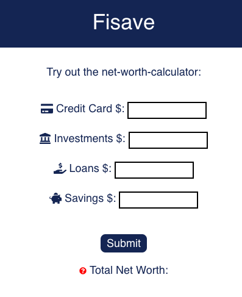
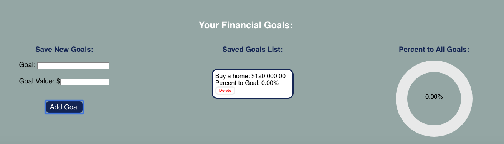
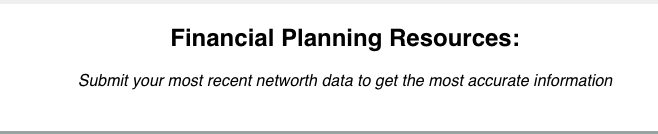

Fisave 
### [Link to Web App](https://networth-client.now.sh/main)

This project was bootstrapped with [Create React App](https://github.com/facebook/create-react-app).

### Summary: 
Fisave is a full stack web app for helping people track their networth over time. 

### Technologies Used: 
Front-end: 
React 
Javascript
HTML/CSS
D3.js for data visualizations

Back-end: 
Node
Express
PostgreSQL

### Sample Login Credentials: 
user name: TestLogin
password: TestLogin1!

Use the homepage as a trial of the service before committing to a log in. 
Fill in any of the options on the form & click submit to see what your current networth is. 

Create an account or log in to access more features & save your data. 

Once logged in, fill out the networth form, access previous networth calculations, get advice, or add goals. 

When you add a goal, you will get a % to goal. It will be calculated using your most recent networth value. 

The advice section will show different advice based on whether the user's networth is positive or negative 

